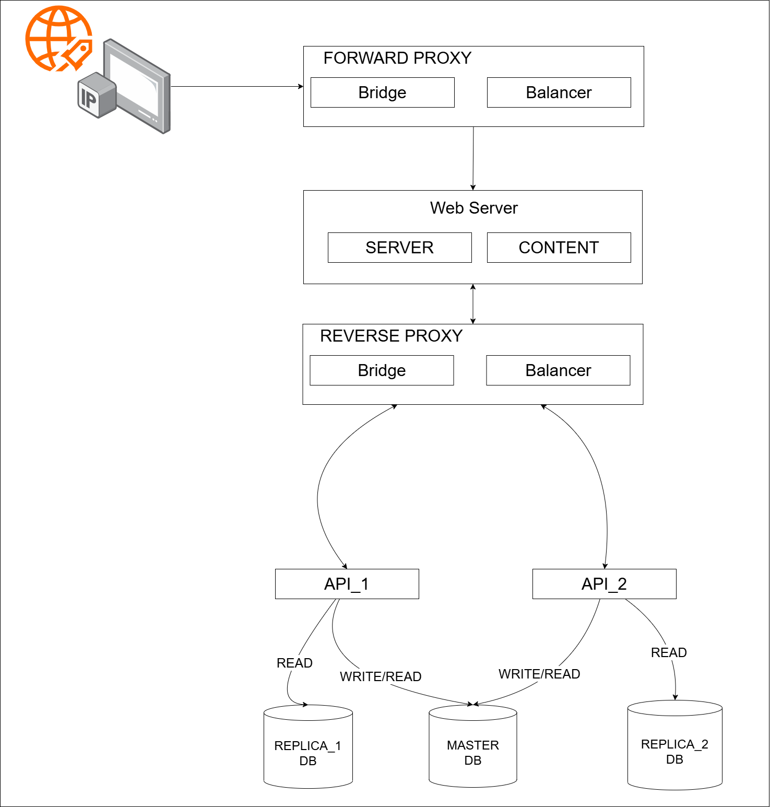

# Prototype of full architecture
A small ToDo app, which will serve as a prototype for the next project's architecture.

## Architecture

### [Forward Proxy](./forward-proxy/README.md)

The explanation behind the forward proxy you can find in `./forward-proxy/README.md`, or just click on the title.

### [Web Server](./web-server/README.md)

The explanation behind the web server you can find in `./web-server/README.md`, or just click on the title.

### [Reverse Proxy](./reverse-proxy/README.md)

The explanation behind the reverse proxy you can find in `./reverse-proxy/README.md`, or just click on the title.

### [Backend (Including database explanation)](./backend/README.md)

The explanation behind the backend and database you can find in `./backend/README.md`, or just click on the title.
