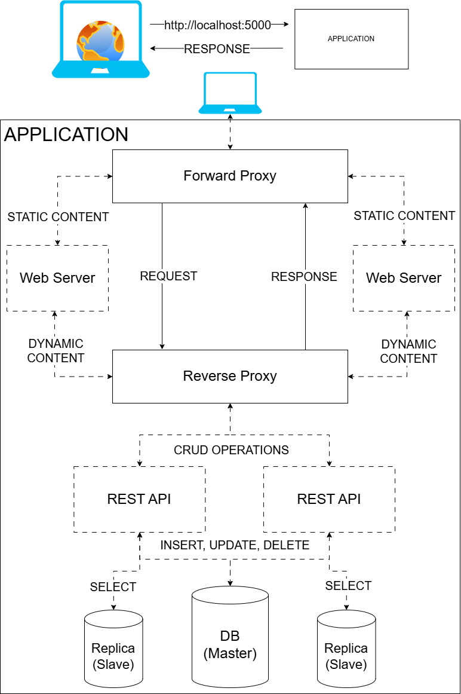

# Prototype of full architecture
A small ToDo app, which will serve as a prototype for the next project's architecture.

## Introduction

This is a practice project. In this project there will be a forward proxy (residential), which will "expose" the web server/s to the internet and be the access point of the application. The web server will be a small app which will on its end connect to a reverse proxy. The reverse proxy will act as a connection bridge between the web server/s and the REST API/s. It will also act as a load balancer (the forward proxy will do the same). The REST API will be a simple application which will provide basic CRUD operations. It will connect to a DB - PostgreSQL. That DB will utilize replicas -> Master and 2 slaves. The master will target all the INSERT, UPDATE, DELETE calls, meanwhile the replicas will handle all the SELECT calls, splitting the calls between one another.

## Architecture

From the architecture we can see that the only endpoint or access point which the client (user utilizng a web browser) will know about is the forward proxy. It will serve as gateway or bridge to the actual web server. The full lines are the presentors or access points. And the dashed lines are the actual elements executing the tasks. We can see that the Forward Proxy connects to the Reverse Proxy, but the actual calls are being done in the web server/s. Similarly to the Forward Proxy it acts as a gateway - acting like it executes the tasks, but in reality it is the REST API. That way the client doesn't know about the web server and Rest API. And the Web Server/Rest API don't know about the client and about each other.

### [Forward Proxy](./forward-proxy/README.md)

The explanation behind the forward proxy you can find in `./forward-proxy/README.md`, or just click on the title.

### [Web Server](./web-server/README.md)

The explanation behind the web server you can find in `./web-server/README.md`, or just click on the title.

### [Reverse Proxy](./reverse-proxy/README.md)

The explanation behind the reverse proxy you can find in `./reverse-proxy/README.md`, or just click on the title.

### [Backend (Including database explanation)](./backend/README.md)

The explanation behind the backend and database you can find in `./backend/README.md`, or just click on the title.
